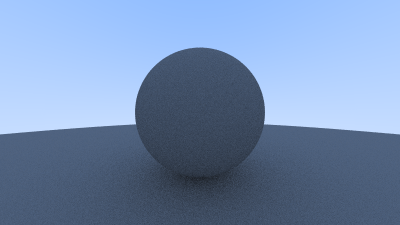

# Ray Tracing in One Weekend | The Book
On the 31st of October 2025 or on Halloween, with nothing to do, my sights were set on going through the "Ray Tracing in One Weekend" book:     
[_Ray Tracing in One Weekend_](https://raytracing.github.io/books/RayTracingInOneWeekend.html)

Below are the generated images that follows the book.    
The first image is from halfway through.

# Generated images:

Lambertian diffuse material.

Switched from linear to gamma color space. (brighter).

Two metal spheres, and a lambertian diffuse at the center.

Fuzz or surface roughness was added to the two metal spheres.

(Left) A material that refracts all light, with a refractive index of glass.

(Left) Surrounding space given refractive index of water, and the sphere the refractive index of air. Also, reflections are added. (Airbubble in water).

Glass sphere that is hollow with air inside. (inner sphere with small radius).

Glass sphere that is hollow with air inside. (inner sphere with bigger radius).

Camera rigging test scene.

Previous used scene seen from upper left-hand corner.

Same as previous image but lower field of view (more distant).

Simulated depth of field through a lens.

Rerendered cover image of the book.

# Credits | The book
[_Ray Tracing in One Weekend_](https://raytracing.github.io/books/RayTracingInOneWeekend.html)
